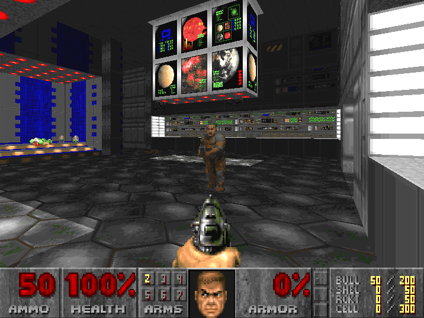

## DoomSpeedrunRL (WIP)

This project uses reinforcement learning to train an agent to speedrun various Doom-style scenarios.

# References

1. M Wydmuch, M Kempka & W Jaśkowski, ViZDoom Competitions: Playing Doom from Pixels, IEEE Transactions on Games, vol. 11, no. 3, pp. 248-259, 2019 (arXiv:1809.03470): https://arxiv.org/abs/1809.03470

2. J. Schulman, F. Wolski, P. Dhariwal, A. Radford, and O. Klimov, “Proximal policy optimization algorithms,” (arXiv:1707.06347), https://arxiv.org/abs/1707.06347